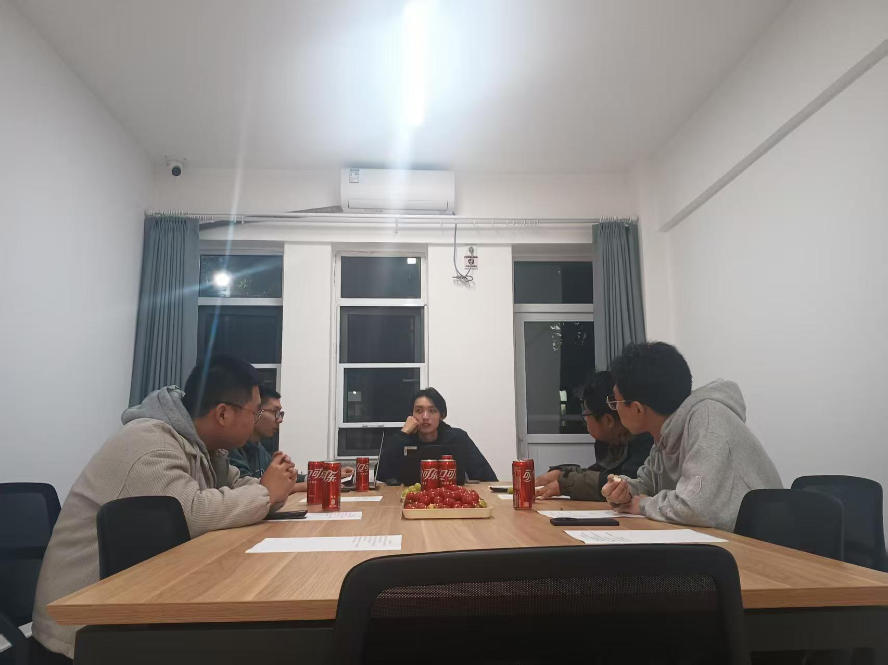

# 2025年10月43号楼楼委会工作日志

## 2025年10月25日 18:30-20:00

**指导老师：**
牟老师

**参与人员：**
楼委会主任师翔宇、安全委员赵坤、宣传委员李思奇

**工作图片：**

**工作内容：**
召开43楼主题座谈会，讨论如下问题：

1. 售货机里加入咖啡等更多种类饮品，加入热量更高体积更大的食品
2. 淋浴间更衣室柜子的衣物需要及时清除
3. 是否可以在厕所添置一个垃圾桶，避免簸箕和小便器隔板上有纸堆
4. 厕所蹲坑位、挂钩和铁板处存在大量纸巾
5. 洗衣房台面滞留衣物较多
6. 2-6层楼道内晾衣架摆放位置不统一，占用公共区域影响消防设施使用
7. 淋浴间更衣室以及门前烟感误报警

