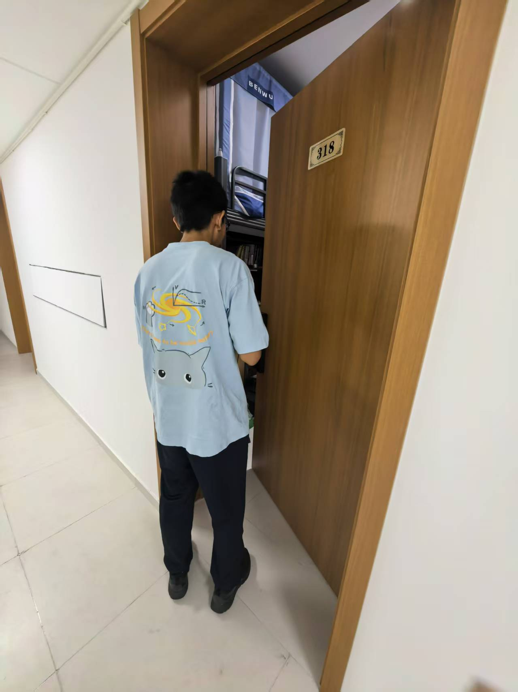
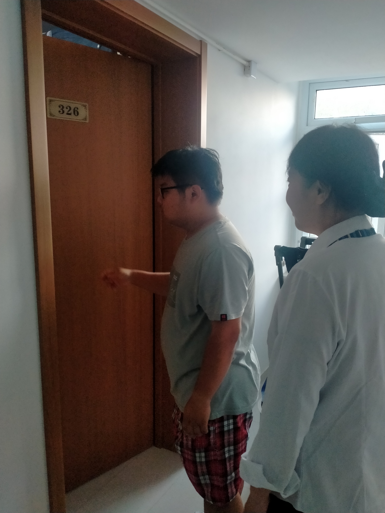
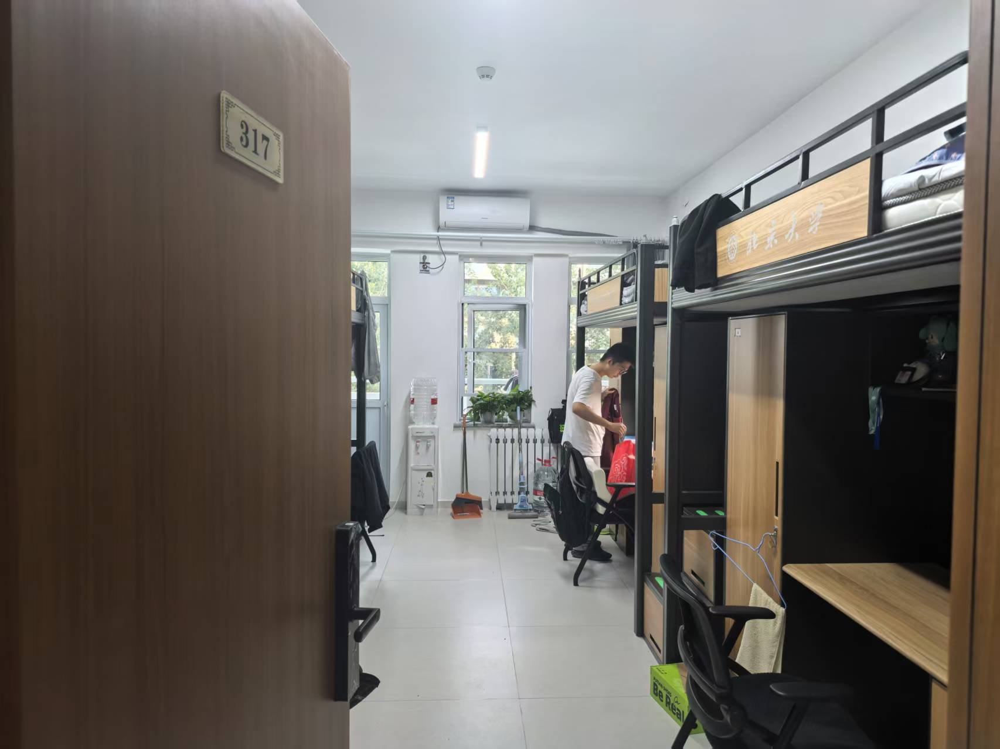
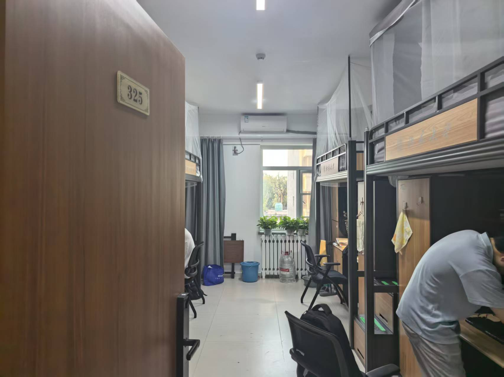
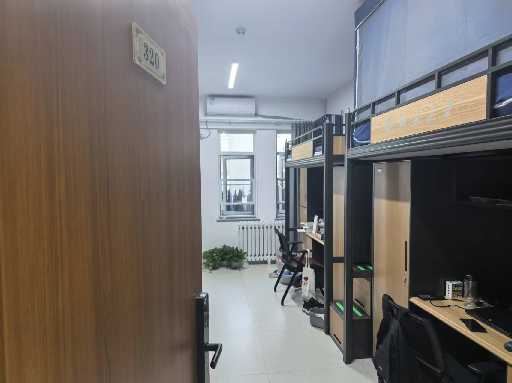
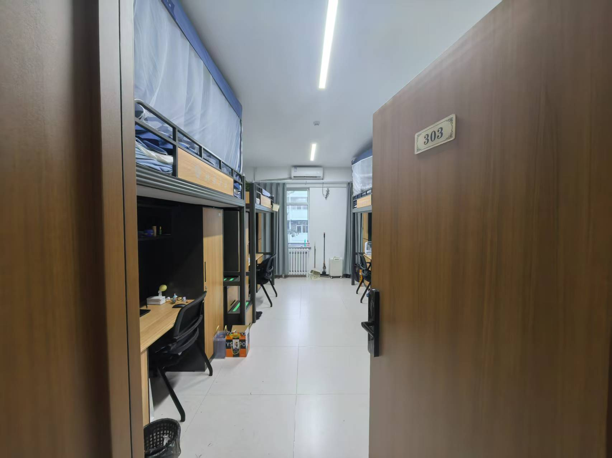
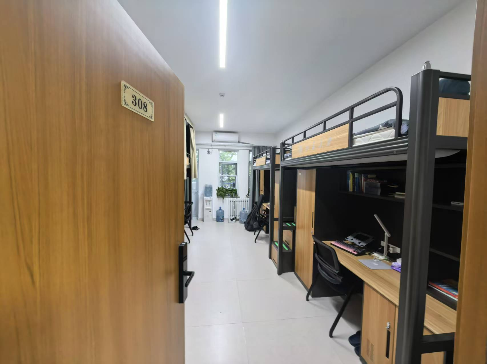

# 2025年9月43号楼楼委会工作日志

## 2025年9月25日 16:30-18:30

**指导老师：**
楼长史老师

**参与人员：**
楼委会主任师翔宇、安全委员赵坤

**工作图片：**

**工作内容：**
3层卫生及安全检查，入户检查了各宿舍的卫生和安全情况，并挑选出5个文明卫生宿舍候选宿舍。

**候选宿舍：**
317（见下图）

325（见下图）

320（见下图）

303（见下图）

308（见下图）

